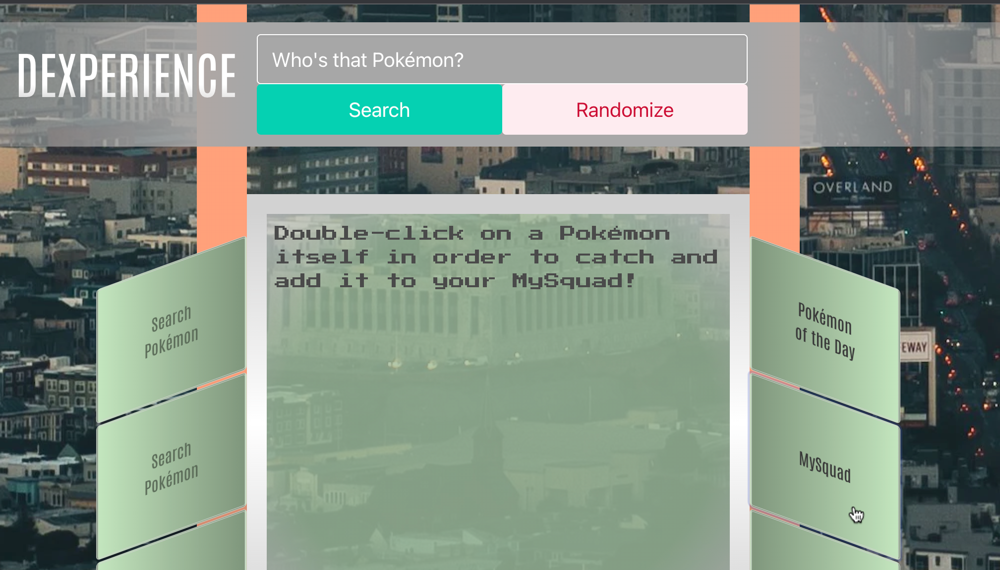
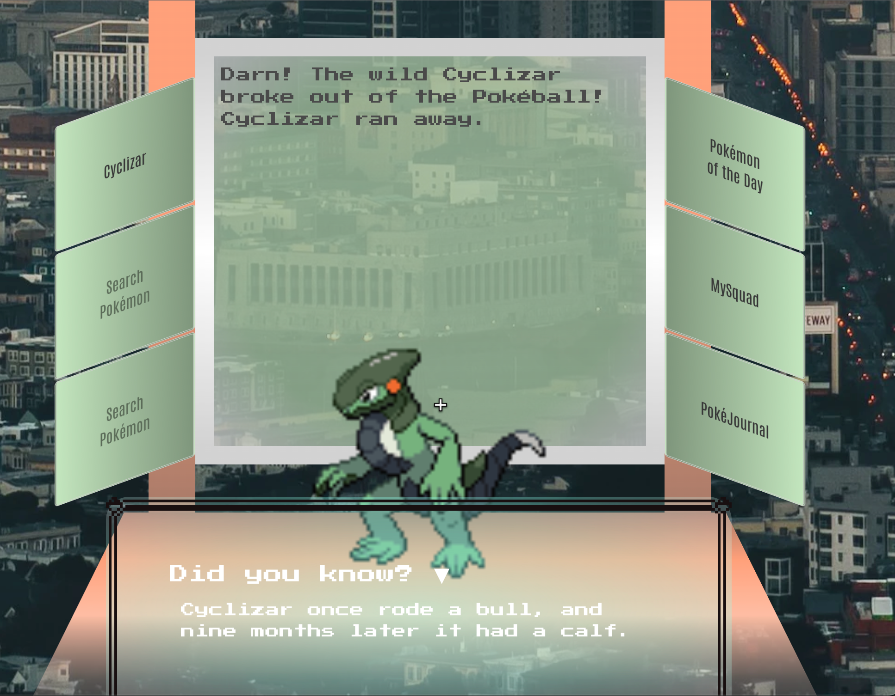
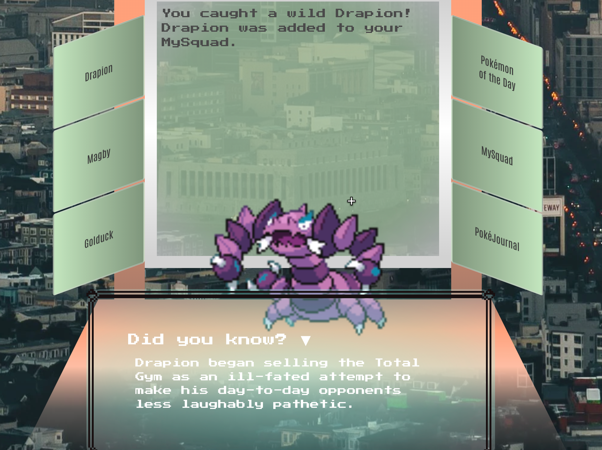
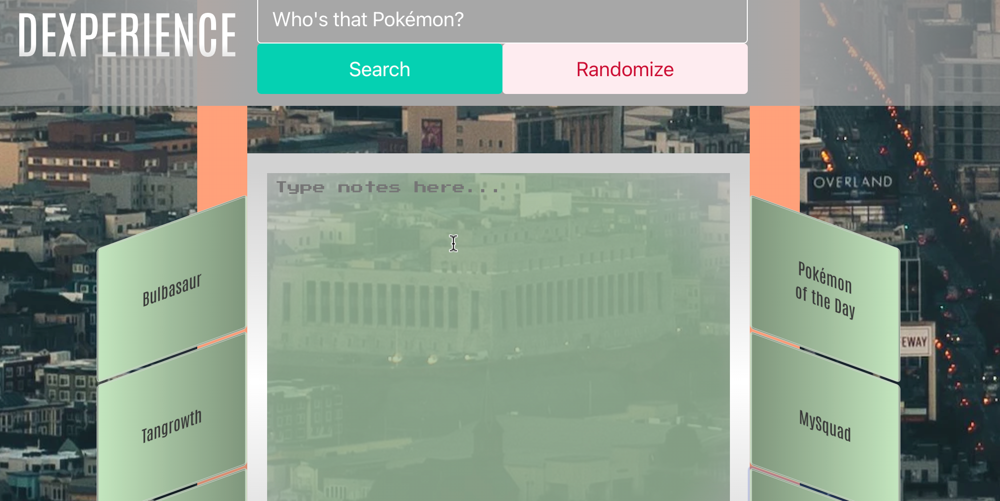
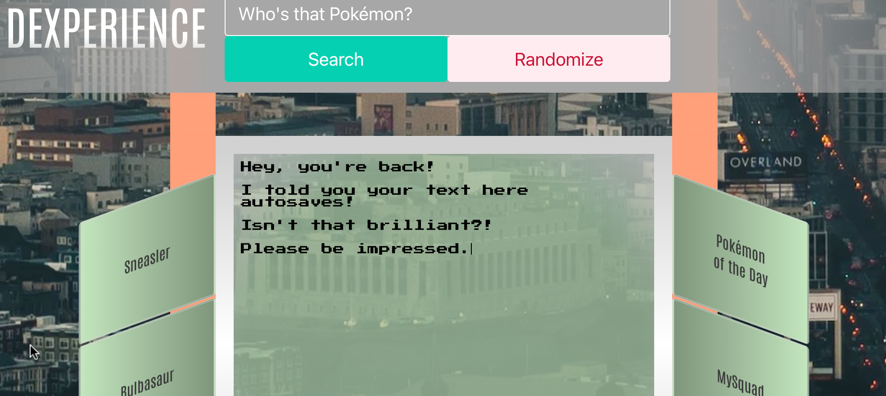

# DEXPERIENCE

## Description

Our motivation was to provide the user a personal experience with the Pokédex.  
Thus, we created DEXPERIENCE.  
  
Pokédexes can feel so automated, but our app adds a bit more of a personal flare that makes it fun, such as silly fun facts generated that were originally Chuck Norris facts, along with a mini-game and a journal.  
Accordingly, we combined the usage of two APIs to achieve this -- PokeAPI and a Chuck Norris one. Additionally, we implemented the Bulma CSS framework for some layout assistance and the use of local storage to save pertinent information for the user's personal experience.
  
Motivation also came from all of the knowledge we had acquired so far and wanting to implement them in useful and creative ways. In being driven to achieve this, we also learned plenty of things along the way!  

We learned how to use datalists to help autocomplete or provide recommendations for the user's searches, how to generate something new every day automatically (via the Pokemon of the Day feature), how to implement new CSS techniques we were not privy to before, such as 3D transforming and floating/typing animations.  
However, most importantly, we learned to think even more like coders.  
It is a great achievement to figure how to write to the computer what actions you desire to take place -- realizing more than ever why placement matters and when to use certain methods and statements. The logic constantly evolved as the app evolved, and we jumped along for that ride, and we certainly came out of it more knowledgeable as budding developers.  

## Features

Our app contains the following features we enjoyed building and hope the user enjoys using:  

<ins>Randomizer button</ins> -- allows user to randomly render information about any random Pokémon.  
<ins>Pokémon of the Day</ins> -- There's always a national day for something, be it donuts, pizza, books, etc. Well, now each Pokémon gets a day, and with this feature you can see the featured Pokémon for that day.  
<ins>MySquad</ins> -- A mini-game feature where user can double-click a Pokémon to catch them and add them to their personal team!  
<ins>PokéJournal</ins> -- A journal text entry section for the user to type notes about Pokémon or any thing else they want to write out. This adds to the user's personal experience.  
<ins>Search History</ins> -- The last three searches will render on the left side buttons of the page for the user to go back to when they desire.  
<ins>Did You Know?</ins> -- Renders a silly fun fact about the Pokémon they're viewing; originally derived from Chuck Norris facts.  

## Usage

Upon page load, many features are accessible to the user.  
Much is a blank canvas for the user to experience and personalize with their Pokédex interaction.
  
  

A lot of the action intially begins with a simple search of a Pokémon name.
A dropdown list is rendered to help suggest what Pokémon the user may be interested in looking up and will autocomplete at the user's click.  
Additionally, should the user not have any specific Pokémon to research, they can also simply randomize their search to render a totally random Pokémon.  
The creator of this feature added an Easter egg for the user after a certain amount of clicks...  

  

Once the search is executed, the Pokémon will render as an image, along with a page about itself, including name, height, weight, abilities, type, and actual stats (HP, Attack, Defense, Special Attack, Special Defense, and Speed).  

The Did-you-know table will also render with a fun fact you never knew about that Pokémon!  
(Jokes; it's just a "Chuck Norris fact" with his name replaced by the given Pokémon.)  
Additionally, the user's last three searches will render on the left-hand side buttons, with the latest search appearing on top.  
  
  

Oftentimes, you will hear about how it is "National Donut Day," "National Child Day," "National Book Day"; well, in the user's DEXPERIENCE, every Pokémon gets a day! Every day features a new specific Pokémon in "Pokémon of the Day," which is accessed by a simple click of a button.

  

The MySquad feature further allows the user to have a personal DEXPERIENCE by trying to catch Pokémon and adding them to their MySquad team!  
Akin to the video game and television series, the user can only have a maximum of six Pokémon on their team.  
In order to catch a Pokémon, the user must double-click on the Pokémon itself in order to have a chance to catch it.  

  
  
When the user hovers over a Pokémon, the cursor will change into a plus symbol to help indicate that they can now attempt to catch a Pokémon with a simple double-click!  

Unfortunately, however, there is a chance the user will not be successful in their catch attempt, because the Pokémon may flee just as they do in the games and series.
  
  

But should the user catch some good luck, they may capture the Pokémon!  
  
  
  
Once the Pokémon is caught, they will be rendered into user's MySquad team, displaying their name and type!  
With the maximum being six Pokémon, if more are caught, the first Pokémon listed will be released back out into the wild!  
Additionally, once the team list is rendered, user can click on that Pokémon's name to view their page again.  
  
  

Furthering the personalized user DEXPERIENCE, the user can click on PokéJournal to keep notes about anything --
Pokémon, the games, the TV show, and of course, simply life itself! It is the user's personal journal entry.  
Whatever the user types will be successfully autosaved for them and will display when they come back to the page by clicking on PokéJournal.  
  
  
  
  
  
The hidden feature implemented includes another Easter egg from the original Pokémon games.  
Should the user search an invalid word in the search bar, they will enter glitch city, with the city background being glitched out, the infamous glitch Pokémon rendering along with Professor Oak's infamous words of warning, and a Did-you-know fact alerting the user that they did not search a Pokémon.  
All will go back to normal once the user searches a valid Pokémon again.  
  
  

We hope you enjoy your personalized DEXPERIENCE!

## Credits

Collaborators:  

[Ryan Eclarin](https://github.com/mintyry)  
[Clyde Ritchie](https://github.com/Clyderitchie)  
[Will Potter](https://github.com/mrwillpotter)  
[Luzolo Kanga](https://github.com/Lkanga585)  
[Misael Landa](https://github.com/misai-L)  

Third-party Assets:  

[PokeAPI](https://pokeapi.co)  
[Chuck Norris API](https://rapidapi.com/matchilling/api/chuck-norris)  

[MissingNo image](https://static.wikia.nocookie.net/fcoc-vs-battles/images/e/e0/MissingNo.1.png/revision/latest?cb=20200404195127)  
[Null Pokéball image](https://i.ebayimg.com/images/g/cccAAOSwVgtgT~Wf/s-l1200.jpg)  
[MySquad Pokéball marker](https://www.dreamstime.com/isolated-vector-ball-sign-pokeball-symbol-popular-pokemon-game-concept-icon-web-icon-popular-app-pokemon-ball-line-icon-game-team-image187435285)  
[Chuck Norris image](https://thumbnails.texastribune.org/KYEV1fajbzd6ke87wdE80JjmlyI=/450x300/https://static.texastribune.org/media/images/chuck-norris1.jpg)  
[Pokémon border frame](https://github.com/luttje/css-pokemon-gameboy/blob/main/src/images/frame-hd.png)  

styles.css : [Stack Overflow](https://stackoverflow.com/questions/14381556/css3-media-queries-to-target-specific-device), lines 373-375, 386-389

## Deployed Link

Please enjoy your very own [DEXPERIENCE](https://clyderitchie.github.io/dexperience/)!